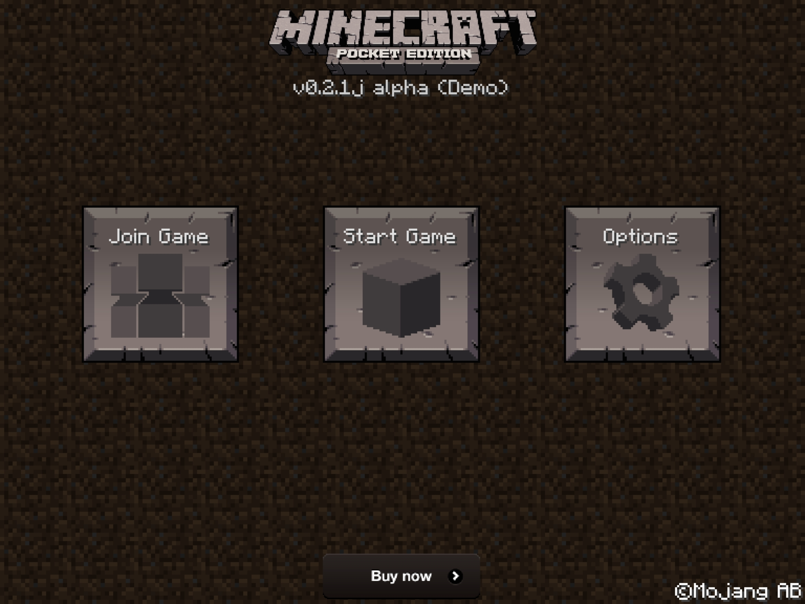
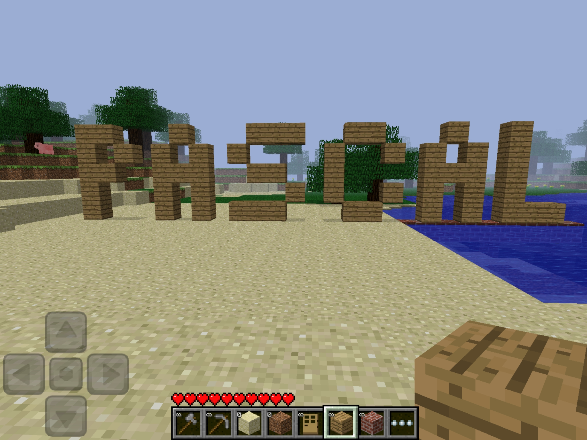
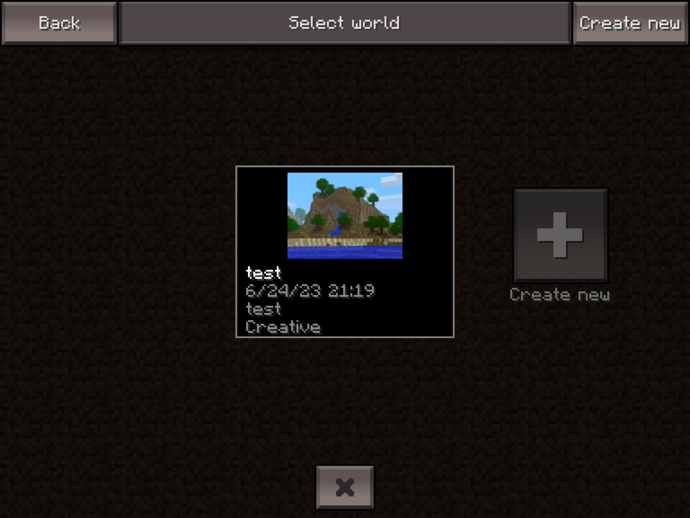

# Old minecraft version

those minecraft versions you see here used to be availlable on playstore until they got taken out, theire fully functionnal old minecraft demo versions ranging from 0.1.0 to 0.2.1 they even work playing multiplayer if the devices are all in the same Lan or Wlan depending on what you use.

i also by chance fell on this one 0.2.1 but full version
you just have to skip the google play protection and you can save worlds there so even better!

### Enjoy!!!!

### here are the versions betwem 1.1.0 and 1.18.0
installing more recent minecraft versions:
[More recent versions here](https://www.dropbox.com/scl/fo/5e20ogpk2o55wp57tifzm/h?dl=0&rlkey=0b2c8n8ydss36ozkjphf4ad8v)

